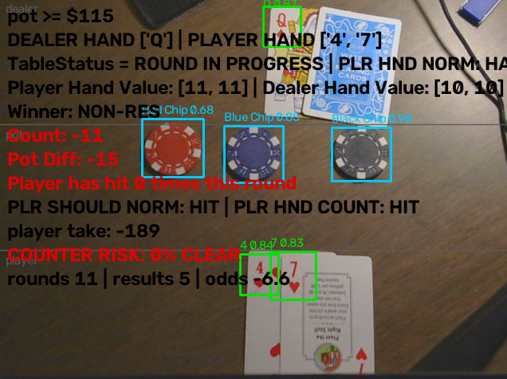

# ALAN

A top down camera watches a blackjack table, reads the cards and chips with two YOLO models, and scores how likely the seated player is to be counting cards.




## What it does

The system runs four stages every frame:

1. **Card detection.** A YOLO11 model trained on corner indices finds rank and suit in the corner of each card. Corner indices are used rather than whole card faces because a fanned hand covers most of every card except the top one.
2. **Chip detection.** A second YOLO model reads chip colour, which is mapped to a dollar value.
3. **Game logic.** Pure Python with no pixels involved. It works out hand values, who is winning, the running count, what an ordinary player would do next, and what a card counter would do next.
4. **Risk scoring.** Evidence from betting behaviour and playing decisions is accumulated across rounds into a single percentage shown on the overlay.

Everything after stage one and two consumes a plain list of `(label, confidence, box)` tuples. That boundary is deliberate. The whole game logic layer and the whole risk metric can be unit tested from a REPL with no camera, no GPU and no model weights.

## Use cases

**Casino surveillance.** The obvious one. Floor staff currently identify counters by watching for a bet spread by eye, which is slow and only catches obvious play. A camera that scores every seat continuously and flags the top of the distribution turns that into a triage problem rather than a watching problem.

**Player self review.** Point it at your own practice table. The overlay shows what basic strategy says, what the count says, and what you actually did, which surfaces the hands where your play drifted. The risk score doubles as a measure of how well you are camouflaging.

**Dealer training and procedure audit.** The vision layer tracks pot totals, hand resolution and round boundaries independently of any human. That is useful for checking payout accuracy and dealing pace without needing a second person at the table.

**Dataset generation.** Every round is logged as structured data: the count at bet time, the bet, the decisions taken and the outcome. That is a labelled dataset of real play, which is otherwise expensive to collect.

**Teaching tool.** The two competing strategy models are visible side by side on screen, which makes the Illustrious 18 index plays concrete instead of a table to memorise.

## How the risk metric works

The core idea is that the project already contains two competing predictions of the player's next move:

- `FindLikleyMoveNormSIMPLE` predicts what an ordinary basic strategy player does. It never sees the count.
- `FindLikleyMoveCountSIMPLE` predicts what a card counter does. It is the same basic strategy plus eight index deviations.

On most hands these two agree. A hand where both predicted the same move teaches nothing, because a counter and a recreational player would have played it identically. The useful hands are the ones where the two disagree, and each of those is an experiment that the shoe set up on its own. Whichever prediction matched the player's actual move is evidence for that hypothesis.

The eight hands where they can disagree, and the direction of each deviation:

```
player  dealer   basic strategy   counter deviates to   at running count
  12      2           HIT               STAND              +3 and above
  12      3           HIT               STAND              +2 and above
  12      4          STAND               HIT               -1 and below
  12      5          STAND               HIT               -3 and below
  12      6          STAND               HIT               -2 and below
  13      2          STAND               HIT               -2 and below
  15     10           HIT               STAND              +4 and above
  16     10           HIT               STAND               0 and above
```

### The aggregation

Evidence is accumulated as log odds rather than as a weighted average of sub scores. A weighted average dilutes, because fifty uninformative rounds drag down one damning observation, and it can only ever move in one direction.

Every player starts at the prior odds of anyone at a table being a counter. With a prior probability `p` of 0.005:

```
L0 = ln( p / (1 - p) )  =  ln( 0.005 / 0.995 )  =  -5.293
```

Each observation contributes a log likelihood ratio, which is the log of how much more likely that observation is from a counter than from an ordinary player:

```
LLR = ln( P(observation | counter) / P(observation | ordinary) )
```

Log likelihood ratios add, which is the whole reason for working in logs. In probability space combining independent evidence needs multiplication and a renormalisation step, and in log odds space it is a sum:

```
L  <-  L + LLR_move + LLR_bet
```

The constants used, with the frequency ratios they came from:

```
LLR_DEV_COUNT     = ln(0.80 / 0.10) =  2.08   played the count deviation
LLR_DEV_NORM      = ln(0.15 / 0.50) = -1.20   played basic strategy when they disagreed
LLR_STRAT_ERROR   = ln(0.03 / 0.055)= -0.60   played neither, a misplay
LLR_BET_WITH      = ln(0.85 / 0.50) =  0.53   bet moved with the count
LLR_BET_AGAINST   = ln(0.10 / 0.50) = -1.61   bet moved against the count
```

Note that `LLR_DEV_NORM` and `LLR_BET_AGAINST` are negative. Evidence in the player's favour subtracts, which a weighted sum cannot express.

### Decay

Once per round the total is pulled back toward the prior, so that a player who stops counting drifts back down and the total cannot run away over a long session:

```
L  <-  L0 + (L - L0) * lambda        lambda = 0.98
```

The resting point is the prior and not zero. Decaying toward zero would mean drifting toward fifty percent certainty, which is the opposite of what an absence of evidence should mean.

### Session wide adjustments

Three measures describe the session as a whole rather than a single round, so they are applied once at conversion time instead of being accumulated.

**Bet spread.** A counter needs roughly an eight to one spread between their minimum and maximum bet for the count to be worth money. A player who never spreads is capped rather than zeroed, since they may be counting without profiting from it:

```
spread = max(bets) / min(bets)
if spread < 4 after 20 rounds:  add -2.00 and cap the final percentage at 40
```

**Total winnings.** Measured as a standard score rather than a raw edge, because a blackjack round has a standard deviation of about 1.15 betting units and an ordinary player's realised edge wanders several percent either way on luck alone. With `u_i` the profit of round `i` divided by its stake:

```
U = sum( u_i )
Z = ( U - mu * N ) / ( sigma * sqrt(N) )

mu    = -0.005   what an ordinary player makes per round, in units
sigma =  1.15    standard deviation of one round, in units
N     = rounds with money on them
```

`Z > 2` adds 0.35 and `Z > 3` adds 0.70. Both are small on purpose. The gap between an ordinary player at -0.005 units per round and a good counter at +0.010 is 0.015 against noise of 1.15, so separating the two on profit alone takes about 23,500 rounds at two sigma. A real counter produces `Z = 0.13` over 100 rounds. When this test does fire it has usually caught a lucky ordinary player, which is why it is weighted the way it is.

**Winning that tracks the count.** Stronger than raw profit, because it compares the player against themselves and so cancels out whether they ran hot or cold overall. Rounds are split by the count held at bet time, and the average result per round is compared:

```
gap = mean( u_i for rounds where count > 0 ) - mean( u_i for rounds where count < 0 )
if gap > 0.25 with at least 15 rounds in each bucket:  add 1.10
```

A player who is simply lucky is lucky in both buckets and the gap stays near zero. A counter is lucky in one bucket on purpose, because that is where both their edge and their larger bets live.

The two profit measures are summed and then capped together at 1.50. Against a prior of -5.293 that means neither can flag anyone on its own. They corroborate the play and bet channels rather than substituting for them.

### Converting back to a percentage

```
L_adj = L + spread_term + min(profit_terms, 1.50)
L_adj = clamp(L_adj, -30, +30)

P = 1 / (1 + e^(-L_adj))
P = min(P, spread_ceiling)
```

The clamp is an overflow guard. `math.exp` overflows near 709 and a long session will drift past that.

### Why the low prior matters

If one player in two hundred counts, then even a detector that is ninety five percent accurate flags mostly innocent people, because the false positives are drawn from a pool four hundred times larger than the true positives. Starting at -5.293 forces the evidence to be genuinely overwhelming before the score crosses fifty percent. The cost of that choice is slower detection; the benefit is that the number means something when it is high.

### Measured behaviour

Driven with simulated players, where the counter both ramps their bet and plays the index deviations, the flat player plays basic strategy at a fixed stake, the loose player varies their bet on nothing and misplays five percent of hands, and the noise player chooses at random:

```
profile     20 rds   50 rds   100 rds   200 rds
counter       70%     100%      100%      100%
flat           0%       0%        0%        0%
loose          0%       0%        0%        0%
noise          0%       0%        0%        0%

40 simulated honest players, 120 rounds each: highest score 0%, none flagged
counter who plays the deviations but never spreads their bet: 40%, held by the ceiling
```

## Project layout

```
cardcount/
  detections/          Detection dataclass and the YOLO wrapper
  vision/              camera capture, attention zones, per band inference
  vision_detection/    TableVision.py, the main loop and entry point
  logic/               pure game logic, no pixels
    CardPairity_NewHands.py    hand values, round state, winner
    CountTheCards.py           Hi-Lo running count
    ConfirmCount.py            StreakGate, frame to frame confirmation
    TopCardPairity.py          corner index pairing
    PredictBestPlay.py         the two competing strategy models
    RiskAgg/
      RiskEval.py              the scoring functions
      AggSecrets.py            all tuning constants
  metrics/             Hi-Lo value tables and rank parsing
models/                cards_best.pt and chips_best.pt
alan_web/, table/      Django app for browser based capture
```

## Running it

From the repository root, not from inside the package:

```bash
python -m cardcount.vision_detection.TableVision
```

Running the file directly puts the script's own directory on `sys.path` instead of the repository root, and the `cardcount` imports will fail.

Camera index, model paths, confidence thresholds and the streak gate length are constants at the top of `TableVision.py`. Every tuning value for the risk metric lives in `cardcount/logic/RiskAgg/AggSecrets.py`.

Press `q` to quit and `z` to toggle the attention band overlay.

### Dependencies

```bash
pip install ultralytics opencv-python
```

Use `opencv-python` and not `opencv-python-headless`. They install into the same `cv2` directory and the headless build has no GUI, so `cv2.imshow` will raise `The function is not implemented`. If both ever end up installed, remove all OpenCV packages and reinstall the one you want.

## Known limitations

**The likelihood ratios are estimates.** The frequency ratios above were chosen to be the right order of magnitude, not measured from real sessions. Until they are calibrated against recorded play, the output is a ranking rather than a calibrated probability.

**One seat only.** `zones.py` defines a single player band, so a second player at the table would fold into the same running total. Making this per person means keying the log odds, bet history and per round state by seat.

**No identity tracking.** The score follows the seat, not the person. If a player leaves and someone else sits down, the accumulated evidence carries over until the decay erodes it, which takes roughly 35 rounds to halve. Reset the log odds between subjects when testing.

